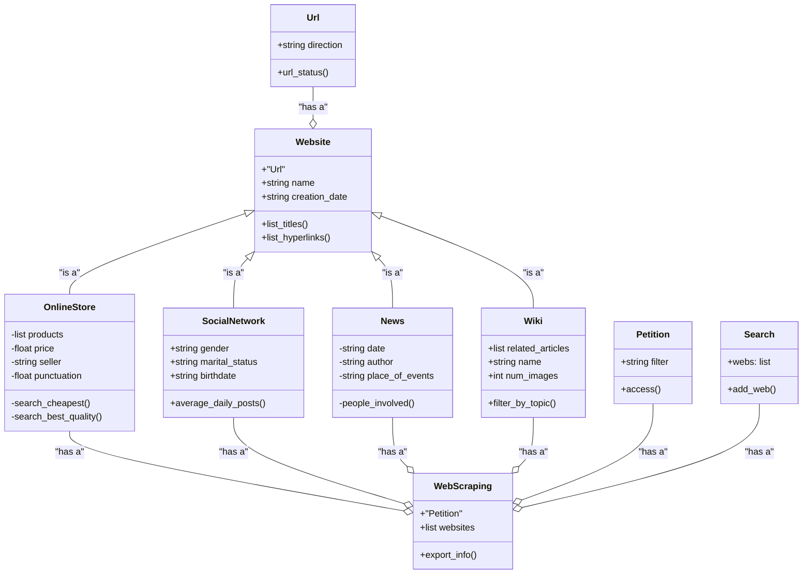

# GnawDaCheese
A web scraping project using Python by the Hacktouille team

---

## What is web scrapping?

Web scraping is an automation technique used to collect specific data from web pages, using mechanisms and scripts that analyze the source code of the page in question to filter large amounts of information and obtain the required data.

### Which are its purposes?

Some of its purposes are:
1. Data collection for analysis and research
2. Competition monitoring
3. Database generation
4. Data collection for AI training
5. Social networks analysis and trend monitoring

### WARNINGS

These are some recommendations to consider before practicing web scraping:
1. Always verify the terms of service
2. Avoid the collection of personal data without consent
3. Do not overload servers
4. Make sure that the use of data is ethical and legal

--- 

## Class diagram

---

## preleminary solution
With Web scraping we purpose is find information quickly using OOP to achieve it
