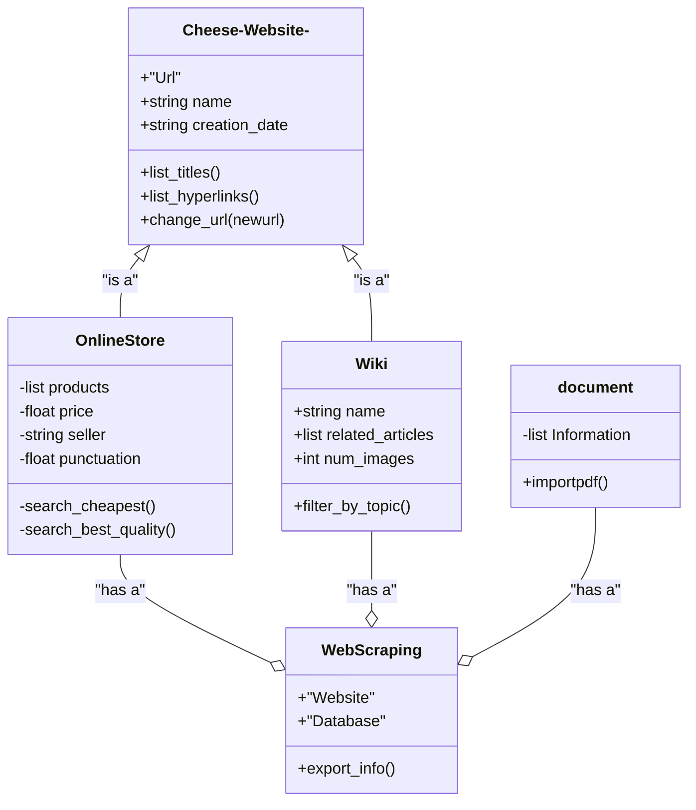

# GnawDaCheese
A web scraping project using Python by the Hacktouille team (Angel Santiago Flórez Rozo and Joan Sebastián Rivera Barajas)

                  .--,       .--,
                 ( (  \.---./  ) )
                  '.__/o   o\__.'
                     {=  ^  =}
                      >  -  <
       ___________.""`-------`"".____________
      /  o                            O      \
      \                                      /                           
      /  .    O     HACKTOUILLE          o   \
      \                                      /         __
      /                                      \     _.-'  `.
      \______________o__________o____________/ .-~^        `~--'
                    ___)( )(___        `-.___.'
                   (((__) (__)))

## What is web scrapping?

Web scraping is a method of automation used to pull particular data from internet sites. It consists of using scripts and automated programs that browse web pages, examine their HTML layout, and gather only the desired information. This approach enables developers or analysts to sort through and gather important data from large quantities of unstructured or partially organized information found online. Rather than manually copying and pasting data, web scraping allows for the automated collection of data on a greater scale, which saves time and enhances precision.

### Which are its purposes?

Some of its purposes are:
1. Data collection for analysis and research
2. Competition monitoring
3. Database generation
4. Data collection for AI training
5. Social networks analysis and trend monitoring

### Python extensions 
-   Beautifulsoup (HTML and XML files) for statics webs
-   Selenium (browser interaction simulation) for dinamic webs
-   Scrapy (big projects) this allows to export data to differents formats (JSON, CSV, databases, etc)

### WARNINGS

These are some recommendations to consider before practicing web scraping:
1. Always verify the terms of service
2. Avoid the collection of personal data without consent (according to Law 1581 of 2012)
3. Do not overload servers
4. Make sure that the use of data is ethical and legal

--- 

## Class diagram

---

```mermaid
    classDiagram
    direction TB
        class Cheese-Website-{
   +"Url"
   +string name
   +string creation_date
   +list_titles()
   +list_hyperlinks()
   +change_url(newurl)
    }

   class Wiki {
   +string name
      +list related_articles
   +int num_images
   +filter_by_topic()
    }

    class OnlineStore {
      -list products
      -float price
      -string seller
      -float punctuation
      -search_cheapest()
      -search_best_quality()
    }

    class WebScraping{
      +"Website"
      +"Database"
      +export_info()  
    }

    class document{
      -list Information
      +importpdf()
    }

   
    Cheese-Website- <|-- OnlineStore: "is a"
    Cheese-Website- <|-- Wiki: "is a"
    OnlineStore --o WebScraping: "has a"
    Wiki --o WebScraping: "has a"
    document --o WebScraping: "has a"
```
## Preleminary solution
Our project will allow to collect, process and organize large amounts of data from multiple websites quickly and efficiently.

Functionalities:
- Dynamic creation of data lists (filtering by specific attributes)
- Store in databases (allowing future use of data)
- Advanced filtering and search (quickly locating significant elements)
- Export and report generation (achieving a better interpretation)

## Requirements
Libraries:
- json (save and load structured data)
- pandas (create Excel sheets from data)
- requests (download the HTML of the web page)
- BeautifulSoup from bs4 (parse HTML and extract titles, tables, links, and text)
- openpyxl (engine needed for pandas to generate .xlsx files)

## The Code

### Subclasses: Wikipedia & Onlinecommerce

#### Wikipedia
This script defines a Wikipedia class that inherits from Cheese. It is designed to scrape and process content from a Wikipedia page, extracting and saving its titles, tables, hyperlinks, and paragraphs.

##### Main Components:
Libraries used:
json for saving structured data.
pandas and openpyxl for exporting to Excel.
requests and BeautifulSoup for web scraping.

Class Wikipedia (inherits from Cheese):
Constructor: Initializes the Wikipedia object with a URL, name, and creation date.
status_code_verification: Ensures the webpage loads correctly (status 200).

Scraping Methods:
gnaw_titles(): Extracts all "<h2>" titles from the page.
gnaw_tables(): Extracts all tables with class "wikitable", and prints their rows and cells.
gnaw_hyperlinks(): Extracts all hyperlinks from the page.
gnaw_text(): Extracts all text from paragraph tags 
.

Saving Methods:
save_to_json(filename): Gathers scraped data, stores it in a structured dictionary and saves it as a JSON file.
save_to_xlsx(xlsx_filename): Reads the previously saved JSON file and converts the stored data (tables, titles, links, paragraphs) into separate Excel sheets.
