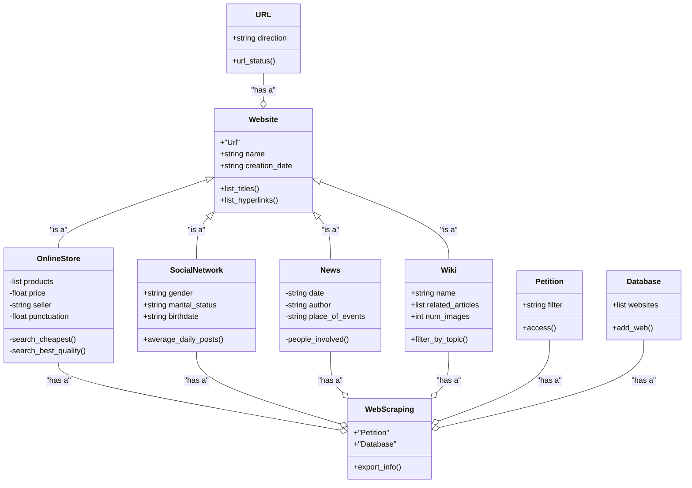

# GnawDaCheese
A web scraping project using Python by the Hacktouille team (Angel Santiago Flórez Rozo and Joan Sebastián Rivera Barajas)

## What is web scrapping?

Web scraping is a method of automation used to pull particular data from internet sites. It consists of using scripts and automated programs that browse web pages, examine their HTML layout, and gather only the desired information. This approach enables developers or analysts to sort through and gather important data from large quantities of unstructured or partially organized information found online. Rather than manually copying and pasting data, web scraping allows for the automated collection of data on a greater scale, which saves time and enhances precision.

### Which are its purposes?

Some of its purposes are:
1. Data collection for analysis and research
2. Competition monitoring
3. Database generation
4. Data collection for AI training
5. Social networks analysis and trend monitoring

### WARNINGS

These are some recommendations to consider before practicing web scraping:
1. Always verify the terms of service
2. Avoid the collection of personal data without consent
3. Do not overload servers
4. Make sure that the use of data is ethical and legal
 
## Class diagram

## Preliminary solution

Our project will allow to collect, process and organize large amounts of data from multiple websites quickly and efficiently.

Functionalities:
- Dynamic creation of data lists (filtering by specific attributes)
- Store in databases (allowing future use of data)
- Advanced filtering and search (quickly locating significant elements)
- Export and report generation (achieving a better interpretation)
  
